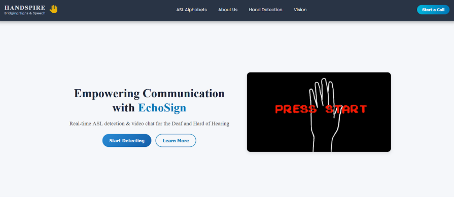
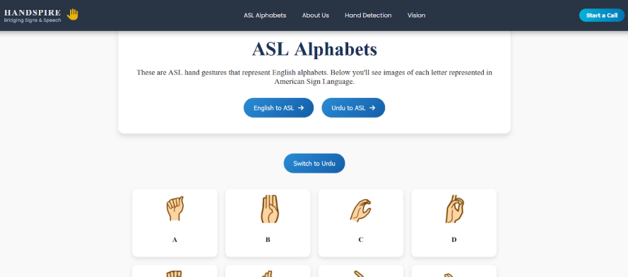
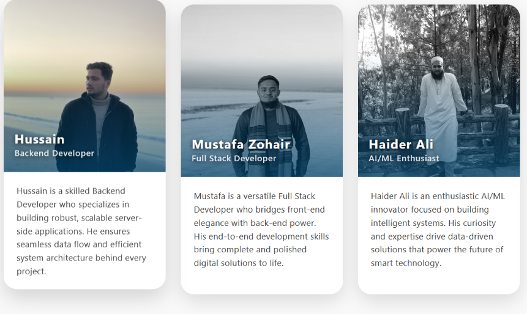
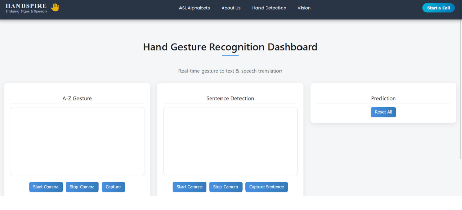
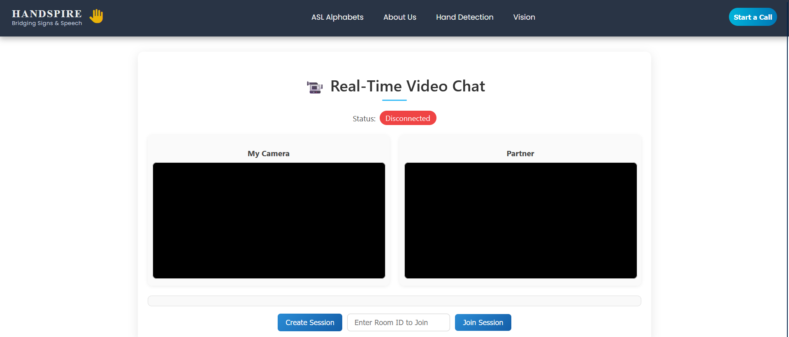

# 🤟 Handspire - Bridging Silence with Technology  
**Final Year Project | Department of Computer Science**  
**Team Lead:** Hussain Abedin  
**Team Members:** Haider Ali, Mustafa Zohair  
**Supervisor:** Ms. Tehniat Mirza  
**Session:** 2021–2025  

---

## 📘 Project Overview

**Handspire** is an intelligent sign language translation system developed to bridge the communication gap between the hearing and speech-impaired community and the rest of the world.  
It primarily supports **American Sign Language (ASL)** and offers translation of both **alphabet gestures** and **conversational gestures**.

Built with a modern and responsive **Angular frontend**, Handspire features custom-trained models, real-time video processing, and chatbot support — making communication seamless, inclusive, and intelligent.

---

## 🎯 Objectives

- To develop a system capable of translating **ASL gestures** (alphabets + common phrases).  
- To provide a **real-time gesture recognition** feature during video calls.  
- To enable **natural interaction** using a chatbot explaining project modules, dataset, and technical components.  
- To build a **custom dataset** for gesture recognition, ensuring high accuracy and adaptability.

---

## 🔧 Technologies Used

| Domain | Tools & Frameworks |
|--------|---------------------|
| Frontend | Angular, TypeScript, Bootstrap |
| Backend | Python, Flask/FastAPI |
| Machine Learning | TensorFlow, Keras, OpenCV, MediaPipe |
| Dataset Labeling | LabelImg, CVAT |
| Real-Time Communication | WebRTC |
| Chatbot | Dialogflow / Custom NLP Bot |
| Model Types | CNN for static signs, LSTM for dynamic gestures |

---

## ✨ Key Features

### 📸 Real-Time Gesture Recognition
- Detects ASL signs through webcam using **OpenCV** and **MediaPipe**.  
- Recognizes both static (alphabets) and dynamic (conversational) gestures.

### 🔄 Real-Time Translation During Video Call
- Integrates **WebRTC** to allow two users to video call.  
- One user's signs are translated and displayed to the other in real-time.

### 💬 Project Chatbot
- Users can interact with a chatbot to learn about:
  - Dataset
  - Model architecture
  - Project goals
  - Technical stack
  - Live demo instructions

### 📁 Custom Dataset
- Over **X,000 images** captured in multiple conditions.  
- Covers alphabets and conversational gestures.  
- Data annotated using **LabelImg** and **CVAT** tools.  
- Dynamic gestures trained using **LSTM**.

---

## 🧪 Project Modules Breakdown

Level 1: Data & Computer Vision
• Image annotation
• Custom dataset creation
• Hand detection using MediaPipe

Level 2: Sign Language Translation
• Alphabet gestures (Static - CNN)
• Conversational gestures (Dynamic - LSTM)

Level 3: Real-Time Communication
• Webcam gesture streaming
• Video calling using WebRTC
• Real-time gesture translation overlay

Level 4: AI Chatbot Integration
• Chatbot for project Q&A
• NLP for chatbot responses
• Frontend integration

Frontend Interface
• Built with Angular
• Responsive and user-friendly UI

📷 Screenshots / Demo
==========================================

How to Run:
======================================
# Clone the repository
git clone https://github.com/your-username/handspire.git

# Navigate to frontend directory
cd Handspire
ng serve -o

# Navigate to backend directories
cd Handspire_Sentence_Api
cd Chatbot_Handspire
cs RealTime_Sentence_Api

pip install -r requirements.txt
python app.py

After Run all three API's your project is completely setup,you good to go to run the project successfully.

📬 Contact
=============
For queries or collaborations:
📧 Email: hussainabedin54@gmail.com

